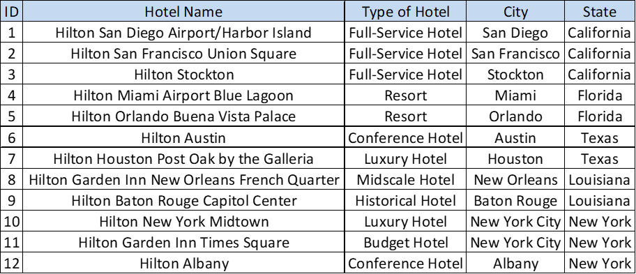
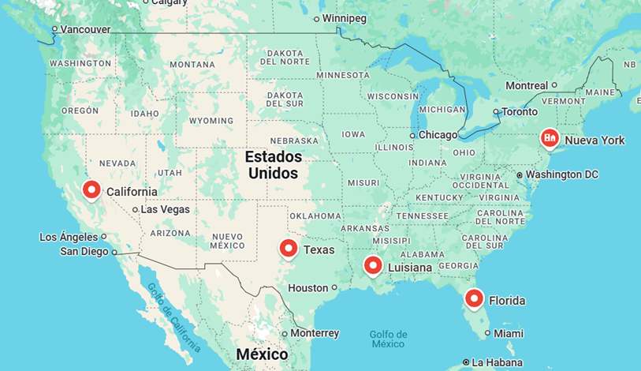

# **Estudio de Mercado y Análisis de Aguacates para Cadena Hotelera**

Nombre del proyecto
# **"AvoEconomics: The Business of Green Gold"**
Cómo el aguacate transforma estrategias en los hoteles de lujo de la cadena Hilton.

## **1. Diagnóstico Actual: Explorando Oportunidades en el Mercado de Aguacates**

Nuestro cliente, la cadena hotelera Hilton (a partir de ahora "Cliente"), enfocada en la experiencia premium, busca diversificar su oferta gastronómica. Con huéspedes con un creciente interés en alimentos saludables y sostenibles, el equipo de negocio de la cadena hotelera ha identificado una oportunidad para incluir menús diseñados para atraer a un mercado de turistas estadounidenses y mexicanos, conocidos por su afinidad cultural con el aguacate en dos zonas estratégicas:

1. Zona sur de EEUU: desde California hasta Florida, donde reside la mayoría de mexicanos.
2. New York: por tener un público de alto poder adquisitivo y exigente.

Por lo tanto, los 12 hoteles alcanzados para este estudio son:

Por lo tanto, las zonas geográficas alcanzadas son:

### Premisas Iniciales
- **Situación actual:** La cadena hotelera no tiene un enfoque claro en alimentos saludables ni en personalización cultural en sus menús premium.  

- **Problemáticas:**  
  1. Fluctuación de precios de aguacates en mercados clave.  
  2. Desconocimiento de la calidad de los aguacates según región de origen.  
  3. Competencia que ya ofrece opciones saludables y culturalmente adaptadas.  

- **Mercado objetivo:** Turistas de EEUU y México, y visitantes internacionales que demandan opciones frescas y saludables.  

- **Competencia:** Resorts líderes que incluyen guacamole gourmet, tostadas de aguacate y opciones con aguacate en sus menús.

### Informe As-Is
Actualmente, el menú carece de opciones diferenciadas, lo que podría representar una pérdida de mercado en comparación con hoteles de la misma categoría. Además, no se han evaluado los precios y calidad del aguacate de regiones clave como México, Perú o California principalmente para garantizar rentabilidad.

---

## **2. Transformando Datos en Oportunidades: Análisis de Ciencia de Datos**

Para abordar estos desafíos, hemos realizado un análisis exhaustivo basado en datos relevantes sobre precios y calidad del aguacate. Para ellos hemos incorporado variables internas y exógenas. A continuación detallamos las fuentes de datos utilizadas:

### Fuentes Internas:
- **Consumo gastronómico de la cadena hotelera:** (consumoshistoricos.csv): Contiene ...<COMPLETAR> 

- **Avocado:** (avocado.csv): Contiene los datos venta de aguacate que nuestro cliente ha comprado de una consultora para analizar internamente. Este acrchivo contiene los campos: Date,AveragePrice,Total Volume,4046,4225,4770,Total Bags,Small Bags,Large Bags,XLarge Bags,type,year,region 

### Fuentes Exógenas:
- **Organización de las Naciones Unidas para la Alimentación y la Agricultura:** (FAOSTAT_Crops and livestock products.csv) Datos históricos y en tiempo real de mercados clave (México, Perú, California).  
- **DOrganización de las Naciones Unidas para la Alimentación y la Agricultura:** (FAOSTAT_data_avocado_Producer_Prices.csv) Datos de búsqueda y tendencias de redes sociales, como Instagram y Google Trends.  

- **Estadísticas de Turismo:** Afiliación cultural y preferencias alimentarias de turistas mexicanos en los destinos clave.

### Metodología
1. **Scraping de Precios:** Datos recopilados de mercados mayoristas y minoristas de aguacates. <COMPLETAR> 
2. **Análisis Exploratorio:** Visualización de fluctuaciones de precios según región y temporada.  
3. **Modelos Predictivos:** Forecasting para determinar los precios en las próximas temporadas.  
4. **Clusterización:** Identificación de regiones con mejor balance de precio y calidad.  
5. **Correlación:** Relación entre precio del aguacate y popularidad de menús con aguacate en hoteles competidores.

### Análisis
- **Hallazgo 1:** Los precios de los aguacates tienden a ser más bajos de marzo a junio, coincidiendo con la temporada baja de turismo.  
- **Hallazgo 2:** México ofrece el mejor balance precio-calidad, pero su precio es más volátil que el de Perú.  
- **Hallazgo 3:** El 35% de las reseñas en redes sociales que mencionan aguacates también hacen referencia a experiencias de lujo, destacando su potencial en el segmento premium.  
- **Visualizaciones:** Incluye gráficos de tendencias, correlaciones y clusters.

---

## **3. Recomendaciones Estratégicas y Conclusiones**

### Insights Relevantes
1. **Adopción de Aguacates Mexicanos:** Incorporar opciones en el menú premium basadas en aguacates mexicanos, destacando su autenticidad cultural.  
2. **Sostenibilidad y Marketing:** Promocionar la inclusión de aguacates como parte de un menú saludable y eco-friendly para mejorar la percepción de marca.  
3. **Ajuste Estacional:** Diseñar estrategias de compra estacional para minimizar el impacto de la volatilidad en precios.  

### Propuesta de Acción
- Incluir platos como tostadas gourmet, guacamole en piedra y smoothies con aguacate.  
- Negociar contratos estacionales con productores mexicanos para asegurar la mejor calidad a precios competitivos.  
- Realizar campañas dirigidas en redes sociales para atraer al mercado objetivo.

---

## **Cómo Usar Este Repositorio**
1. **Carpeta `/data`:** Contiene los datasets utilizados, incluyendo precios históricos y datos turísticos.  
2. **Carpeta `/notebooks`:** Jupyter Notebooks con los análisis de datos y visualizaciones.  
3. **Carpeta `/reports`:** Resúmenes ejecutivos y gráficos listos para presentaciones.  

---

## **Acerca del Proyecto**
Este proyecto fue desarrollado como parte de un trabajo práctico para un posgrado en Data Science. Nuestro enfoque combina análisis de datos avanzados con una narrativa estratégica para apoyar decisiones empresariales en la industria hotelera.
