# **Estudio de Mercado y Análisis de Aguacates para Cadena Hotelera**

# **"AvoEconomics: The Business of Green Gold"**
Cómo el aguacate transforma estrategias en los hoteles de lujo de la cadena Hilton.

## **Equipo de Proyecto**

* Julieth Vasco Bueno
* Gustavo Chavez

## **Planificación**

En nuestro proyecto, adoptamos una metodología ágil para planificar y gestionar tareas, utilizando GitHub como nuestra principal herramienta de colaboración.
Esta metodología nos permitió dividir el trabajo en pequeñas entregas incrementales, priorizando y ordenando la colaboración interna.
En GitHub, implementamos un tablero Kanban, estructurando el flujo de trabajo en columnas como "Por hacer", "En progreso" y "Completado".

Cada tarea fue registrada como un *issue*, con descripciones claras, asignaciones responsables y etiquetas que facilitaron la organización y priorización.
Los *milestones* nos ayudaron a definir metas clave y seguir nuestro progreso en tiempo real.

Esta estrategia no solo aumentó la transparencia del equipo, sino que también fomentó una comunicación más fluida y una toma de decisiones más ágil.

---

## **1. Diagnóstico Actual: Explorando Oportunidades en el Mercado de Aguacates**

Nuestro cliente, la cadena hotelera Hilton (a partir de ahora "Cliente"), esta enfocada en mantener una experiencia premium, con una oferta gastronómica optimizada.

""
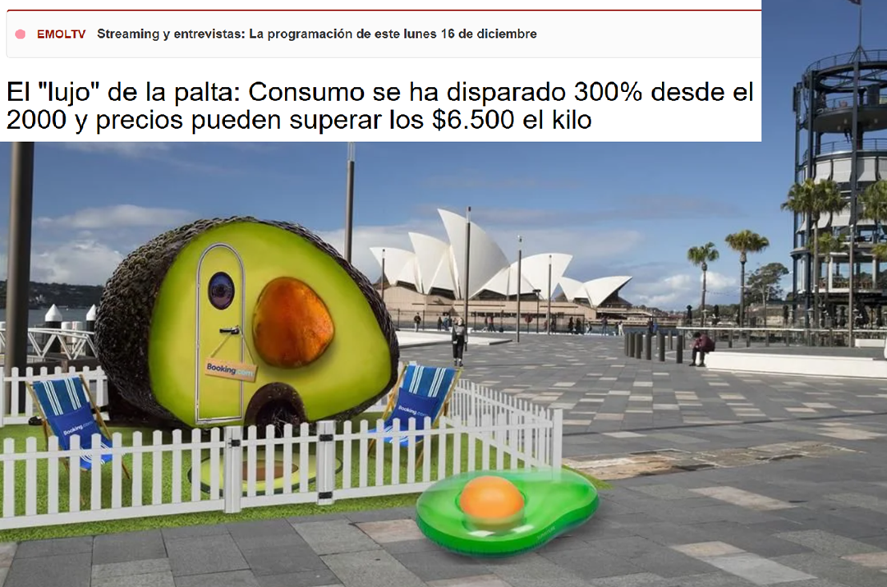

Con huéspedes que en los últimos años han demostrado un creciente interés en alimentos saludables y sostenibles, el equipo de Planificación Estratégica del Cliente ha identificado una oportunidad para optimizar los costos y desperdicios de sus menús diseñados para atraer a un mercado de turistas estadounidenses y mexicanos, conocidos por su afinidad cultural con el aguacate focalizandose en dos zonas estratégicas:

1. Zona sur de EEUU: desde California hasta Florida, donde reside la mayoría de mexicanos debido a la cerca con su país de origen.
2. New York: por tener un público exigente y de alto poder adquisitivo.

Por lo tanto, los 12 hoteles alcanzados para este estudio son:

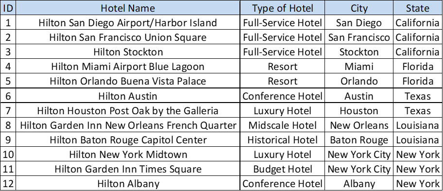

Por lo tanto, las zonas geográficas alcanzadas en esta iniciativa son:

### Premisas Iniciales
- **Situación actual:** La cadena hotelera no tiene una buena gestión de compras, ni un enfoque claro en alimentos saludables ni en personalización cultural en sus menús premium.

- **Problemáticas:**
  1. Fluctuación de precios de aguacates en mercados clave.
  2. Falta de claridad sobre la potencial demanda de aguacates en cada hotel.
  3. Alta tasa de desperdicios de aguacates.

- **Mercado objetivo:** Turistas de EEUU y México, y visitantes internacionales que demandan opciones frescas y saludables.

- **Competencia:** Resorts líderes que incluyen guacamole gourmet, tostadas de aguacate y opciones con aguacate en sus menús.

### Informe As-Is
Actualmente, el menú de nuestro cliente carece de opciones diferenciadas, lo que podría representar una pérdida de mercado en comparación con hoteles de la misma categoría. Además, no se han evaluado los precios y calidad del aguacate de regiones clave como México, Perú o la misma California para garantizar rentabilidad y la sostenibilidad de la oferta en el tiempo. Tampoco se planifica y negocio la compra de aguacates de forma adecuada.

Debido a la amplia opciones de mejoras y oportunidades, para esta primera fase se acuerda con el Cliente focalizarnos en responder dos preguntas claves de negocio:

  **Eficiencia en la cadena de suministro y abastecimiento**

  Pregunta clave: ¿Estamos comprando los aguacates de proveedores que equilibran precio, calidad y confiabilidad, minimizando el tiempo de transporte y maximizando la frescura?

  Por qué es importante: Los aguacates tienen una vida útil limitada. Trabajar con proveedores cercanos o con procesos logísticos ágiles asegura que lleguen frescos y se reduzca el desperdicio.

  **Monitoreo del desperdicio**

  Pregunta clave: ¿Qué porcentaje de los aguacates comprados termina en desperdicio, y qué procesos estamos implementando para reducirlo?

  Por qué es importante: El desperdicio no solo afecta la rentabilidad, sino que también contradice objetivos sostenibles. Evaluar puntos críticos (preparación, almacenamiento o sobrantes en platos) es clave para minimizar pérdidas.

---

## **2. Transformando Datos en Oportunidades: Análisis de los Datos**

Para abordar estos desafíos, hemos realizado un análisis exhaustivo basado en datos relevantes sobre precios y calidad del aguacate. Para ellos hemos incorporado variables internas y exógenas. A continuación detallamos las fuentes de datos utilizadas:

### Fuentes Internas:
- **Consumo gastronómico de la cadena hotelera:** (consumoshistoricos.csv): Contiene ...<COMPLETAR>

- **Avocado:** (avocado.csv): Contiene los datos venta de aguacate que nuestro cliente ha comprado de una consultora para analizar internamente. Este acrchivo contiene los campos: Date,AveragePrice,Total Volume,4046,4225,4770,Total Bags,Small Bags,Large Bags,XLarge Bags,type,year,region

- **Campo derivado**: Para poder estimar la cantidad de aguacate convencionales y orgánicos contenidos en una tonelada y estimar el precio de la tonelada, hemos creado/agregado nuevos campos derivados. Para estimar los pesos promedios de cada aguacate según su tipo nos hemos basado en la siguiente tabla de estandarización:

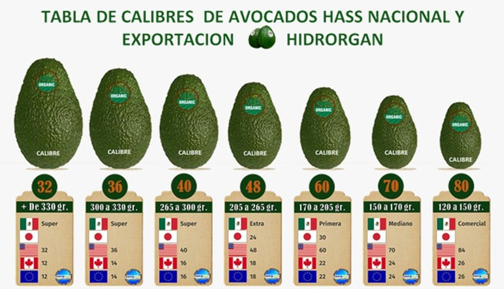

Por lo tanto, determinamos los siguientes pesos promedio según el tipo de aguacate: **convencional 250gr** y **orgánico 300gr**.

### Fuentes Exógenas:
- **Organización de las Naciones Unidas para la Alimentación y la Agricultura:** (FAOSTAT_Crops and livestock products.csv) Datos históricos y en tiempo real de mercados clave (México, Perú, California).
- **Organización de las Naciones Unidas para la Alimentación y la Agricultura:** (FAOSTAT_data_avocado_Producer_Prices.csv) Datos de búsqueda y tendencias de redes sociales, como Instagram y Google Trends.

- **Estadísticas de Turismo:** Afiliación cultural y preferencias alimentarias de turistas mexicanos en los destinos clave.

### Metodología
1. **Variables Exógenas:** No fue necesario hacer scraping debido a que pudimos obtener acceso a datos oficiales del mercado de aguacates.
2. **Análisis Exploratorio:** Visualización de fluctuaciones de precios según región, temporada y otras variables que mostraremos a continuación.
3. **Análisis de Cohortes:** Análsis de la estacionalidad, desperdicios y eventos.
4. **Modelos Predictivos::** Utilizamos regresión lineal, regresión polinómica y random forest para la proyección de precios, y previamente realizamos un análisis de proveedores top 10.

### Análisis

#### 1. **Variables Exógenas:**
No fue necesario realizar scraping debido a que pudimos obtener acceso a datos oficiales del mercado de aguacates descargando un archivo csv.

   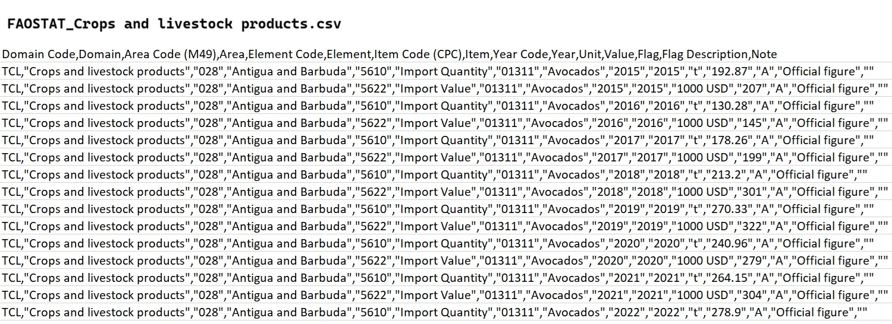
   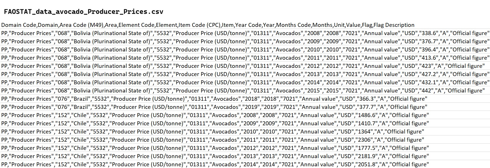

- **Hallazgo:** Los datos recibidos son heterogéneos, exceden el alcance de nuestro foco actual por lo que debemos preparar y ordenar el set de datos adecuadamente, redefiniendo por ejemplos las 5  regiones a analizar: New york, Louisiana, Texas, Florida, California. Lo mismo aplicado a los datos exógenos recolectados. Esto aplica tanto a las variables exógenas visualizadas aquí, como a los datos internos de histórico de compras.

#### 2. **Análisis Exploratorio:**
Visualización de fluctuaciones de precios según región, temporada y otras variables que mostraremos a continuación.

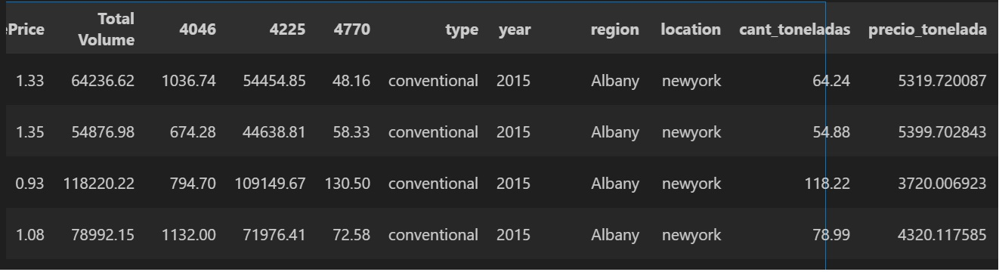

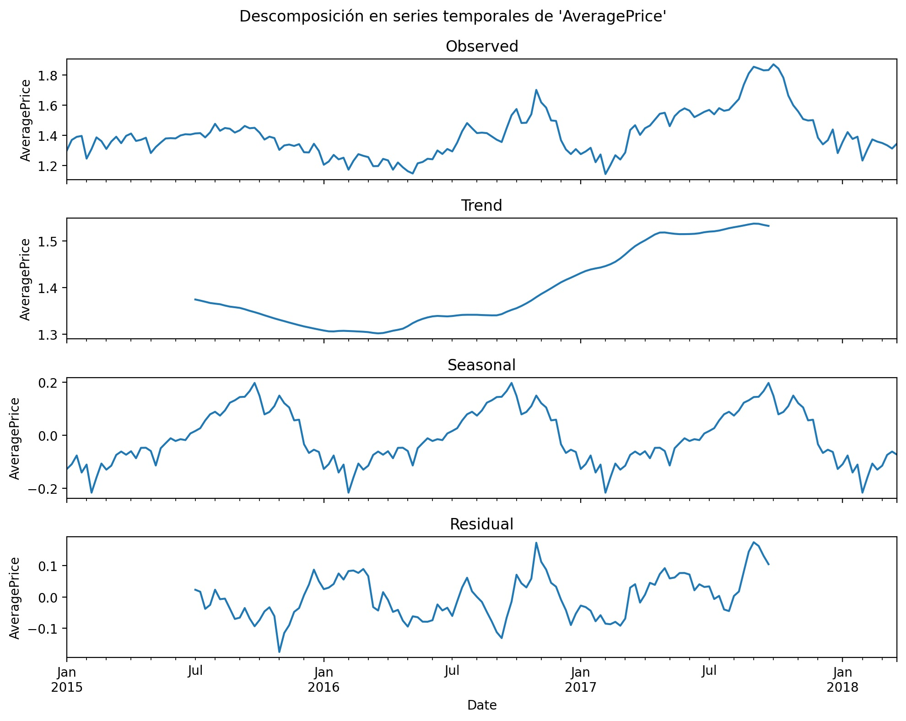

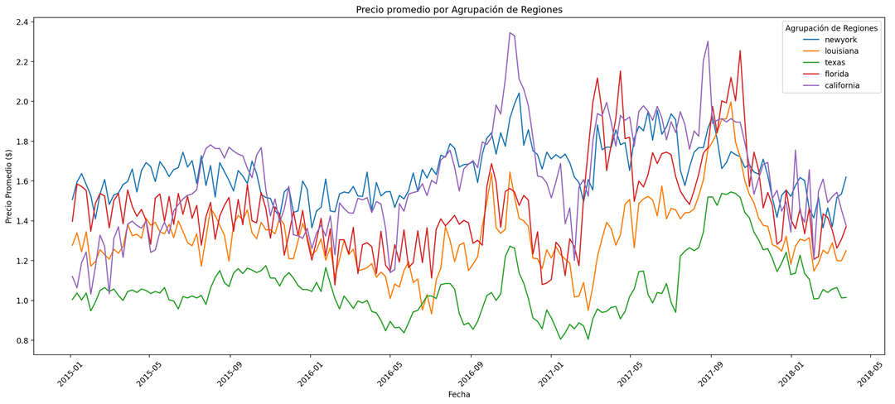

- **Hallazgo:** Luego de proyectar la proporción de aguacates convencionales y orgánicos, y estimar su peso, calculamos también el peso en toneladas y precio, procedemos al análisis de series de tiempo para determinar el comportamiento por mes y región.
Se puede observar que anualmente se repite una bajada en el AveragePrice en el mes de Febrero así como un pico de subida en los meses de Octubre y Noviembre.
Esto podría deberser a que en septiembre inicia el fin de la temporada de cosecha del aguacate, y por eso tenemos un costo más alto en Octubre y Noviembre, si le sumamos también que en Noviembre hay el día de Acción de Gracias donde es muy común el uso del aguacate para hacer Guacamole en USA.

#### 3. **Análisis de Cohortes:**

#### 3.1 **Estacionalidad**

- Cohorte Mensual: Análisis mensual de volúmenes de compra por región para identificar patrones estacionales.
- Comparación Año a Año: Comparar volúmenes y precios promedio año a año para identificar temporadas de alta demanda.

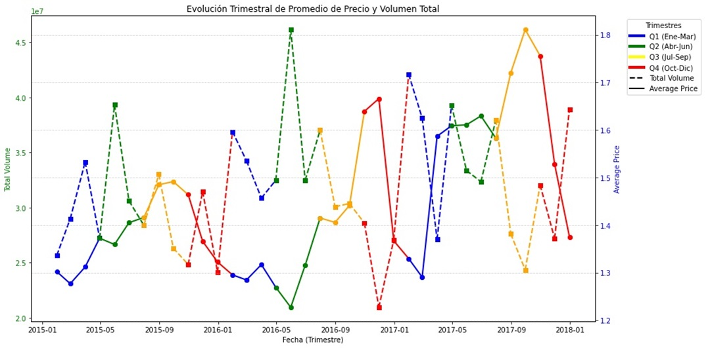

Se puede observar que cuando los precios han sido más bajos se han aprovechado a adquirir mayores volúmenes de compra. Se observan picos de compra en primavera, especialmente en mayo, previo a el verano.

También se puede observar que en aquellos picos donde el precio ha sido más alto, la compra ha disminuído, y cuando la compra se ha situado por debajo del precio, como en el caso de Q4-2016 y Q1-2017, correspondiente al SuperBowld de ese año, donde en el Q anterior se compraron bastantes aguacates, también relacionado con las festiviades y para Q1 disminuye considerablemente.

Se oberva un pico en el consumo de aguacates en junio del 2016, puede hacer referencia a fechas cómo el 4 de Julio.

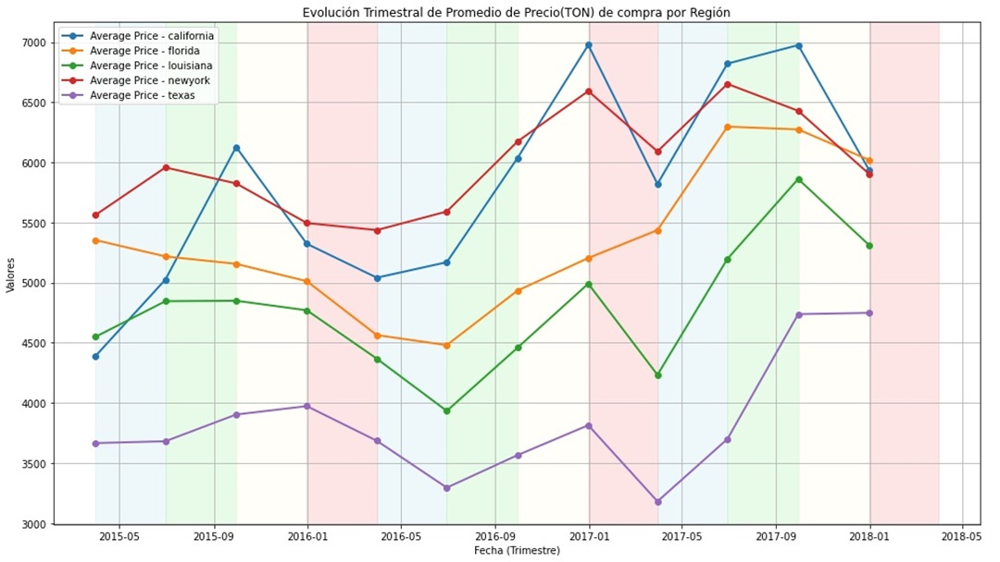

Fechas del Super Bowl:
--> 50	7 feb, 2016	Levi's Stadium	Santa Clara, California
--> LI	5 feb, 2017	Houston, Texas (3)

En el Super Bowl del 2017 se consumieron cerda de 200 millones de dólares en aguacates. Por eso se observa un aumento particular en el aumento del precio para otros estados, menos para Texas, suponemos se debe a un efecto de la economía de escala y la proximidad a los proveedores.

#### **3.2 Exceso de Compras (Desperdicios o Fechas Especiales):**
- Compras Atípicas: Detectar semanas con volúmenes significativamente inferiores a 1 tonelada para reducir costos adicionales en transporte, por falta de planificación.
- Compras Atípicas: Detectar semanas con volúmenes significativamente superiores a la media para investigar posibles desperdicios.
- Eventos Especiales: Identificar picos de compras asociados con eventos conocidos o temporadas de promociones de hoteles.

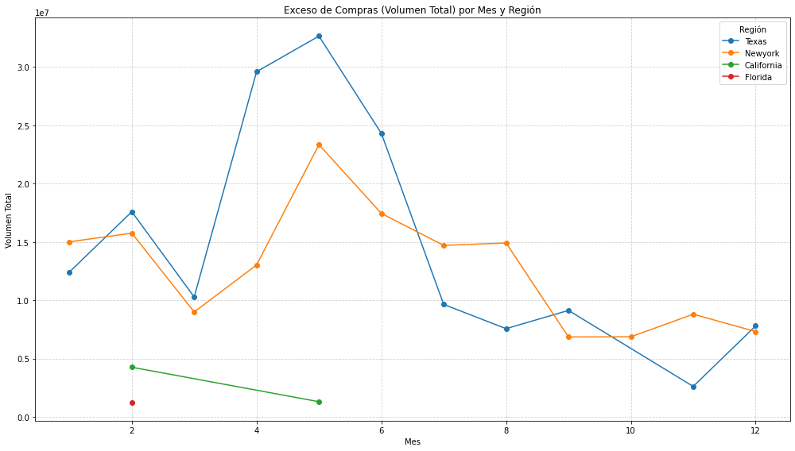

Observaciones del análisis de cohortes:
- Concentración de outliers: Los valores atípicos representan compras muy grandes de aguacates. Esto podría estar relacionado con eventos especiales, altas demandas estacionales o errores en los datos.
- Precios moderados: A pesar de los altos volúmenes, los precios son relativamente bajos, lo que podría indicar promociones o economías de escala.
Distribución temporal: Los años 2015-2017 parecen ser periodos clave para estas compras atípicas.

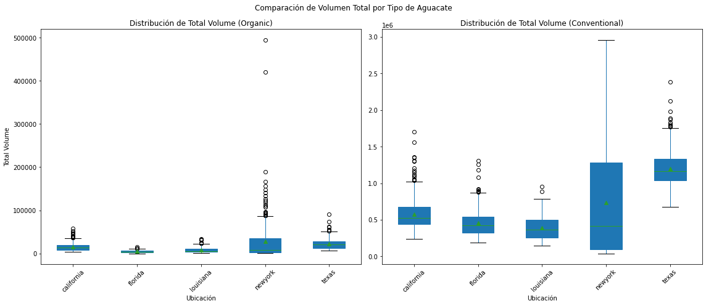

En la visualización anterior se observan la distribución del volumen total por cada tipo de aguacate y por cada ubicación, se observan que en el caso de NewYork se presentan outliers en aguacate orgánico. A continuación vamos a analizar para observar que pudo haber sucedido. En el caso de los aguacates convencionales observamos mayores diferencias en California y en Texas.

**Compras de aguacate más altas por region**

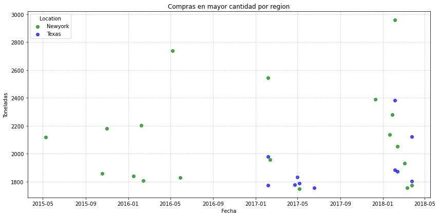

A continuación podemos observar las compras más altas realizadas Newyork:
- En el caso de Newyork, se pueden observar compras seguidas en octubre 2015, estas coinciden con fechas de Halloween y la maraton de Newyork, que se celebra la primera semana de Noviembre, donde posiblemente la demanda iba a ser muy alta en los distintos hoteles.
- Compras recurentes a inicios del 2016 con un total de 3 en el Q1, realizadas en febrero, en temporada de San Valentin. El siguiente pedido grande se produjo en mayo, casi 90 días después. Se observa que este patrón se repite en 2017 y 2018.
- En 2018 se realizan compras a durante marzo, este es un fenómeno tardío, no repetido en los periodos anteriores.

En el caso de Texas podemos observar:
- Las compras más grandes se realizan a partir del 2017, siendo en Q1 el 05 de febrero, se realizaron dos pedidos de +3749 toneladas.
- Además en muy poco tiempo últimos días de abril y primeros días de mayo se realizaron 4 pedidos más en 2017 y en 2018, correspondiente a la celebración del Cinco de Mayo.

**Compras menores a 1 tonelada por region**

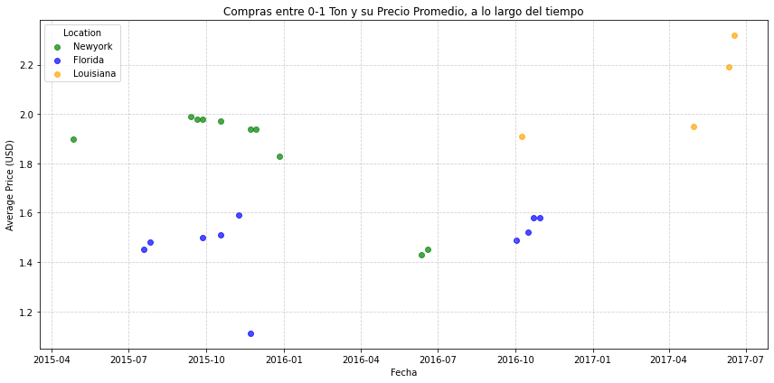

- Aquí se puede observar la cantidad de compras de pedidos de aguacates menores a una tonelada, en total son 24 a lo largo del tiempo, destacando New York y Florida como los principales, esto provoca mayores costes cuanto más pedidos, se ha de pagar transporte, y demás costes asociados. Es por eso que una planeación adecuada puede ser la solución.
- Podemos observar que todas las compras se deben a la compa de aguacate orgánico, para el caso de Florida este suceso ocurrio entre julio 2015 y diciembre 2015, y de nuevo se repitio en octubre 2016, con 4 pedidos <1 tonelada. Pagando un precio por encima de la media 1.39USD por unidad.
- En el caso de las compras en Newyork estas se encuentran muy por encima de la media, superando +1.8USD, se agrupan estas compras en septiembre 2015 y finales del mismo año, y de nuevo en junio del 2016, obteniendo un mejor precio.
- Por otro lado, Louisiana presenta las compras con el precio medio más alto >1.8USD, llegando a superar los 2USD, esto para compras de aguacates inferiores a 1T es asumir un coste mayor, además se observa que se trataron de pedidos a finales de Q2 2017.

#### **3.3 Cohortes basados en semanas festivas y vacaciones**

Se contemplaron las siguientes actividades festivas para analizar, tomando en cuenta los momentos más relevantes según la región:

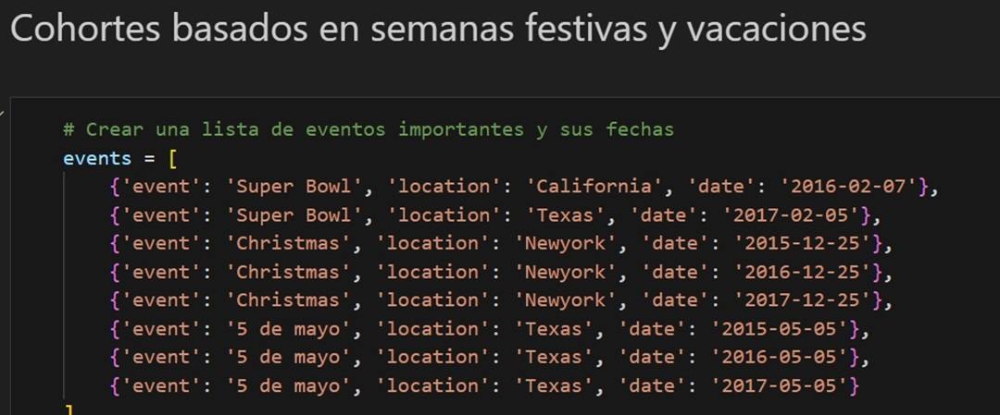

A continuación podemos observar el volumen de toneladas comprado en dichos periodos, contemplando la fecha del acontencimiento y 21 días hacia atrás. Observamos un aumento creciente año tras año.

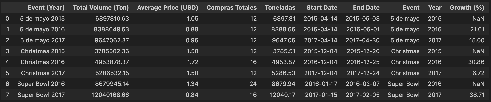

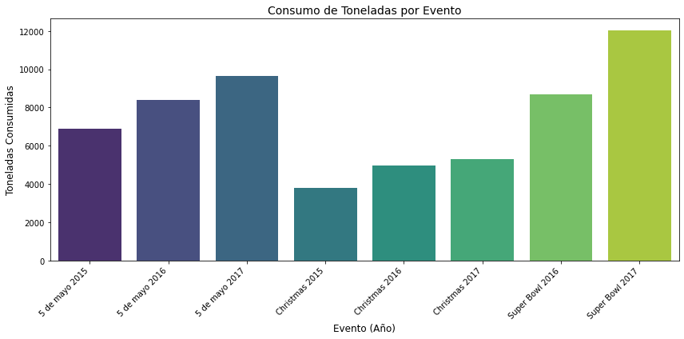

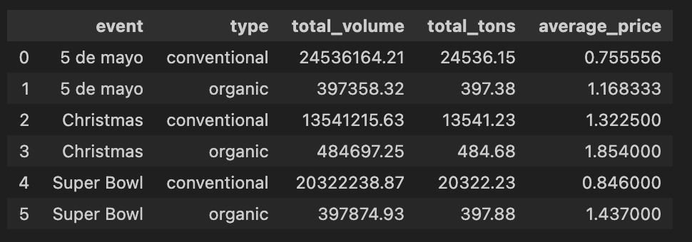

- **Hallazgo:**
- Hemos podido observar los patrones de compra y volúmenes, esto nos permite obtener un mayor entendimiendo para planear una mejor estrategia de compras.

4. **Análisis de proveedores:** Utilizamos análisis de proveedores top 10, precios de compra vs precios de venta y proyección del precio, a través de regresión lineal, polinómica y random forest.

Distribución de `precio_tonelada` por ubicación y tipo

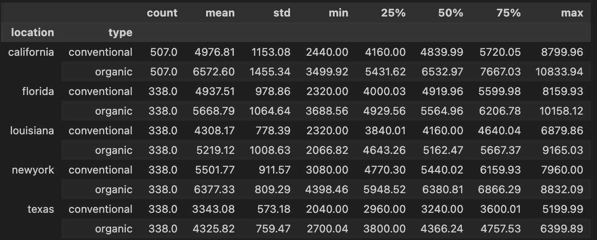

Precio medio anual que paga el hotel por tonelada de aguacate

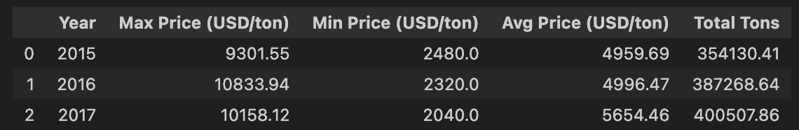

**Cálculo de las exportaciones**

A continuación vamos a enfocarnos en garantizar una oferta estable y evaluar la capacidad de exportación, se van a analizar volúmenes exportados y valores comerciales.

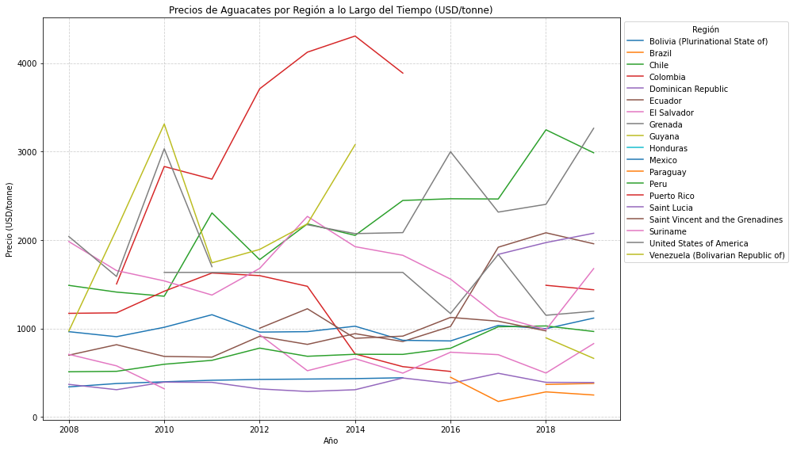

**Países con Mayor Exportación:**

- México destaca significativamente por su volumen exportado constante y creciente, lo que lo posiciona como un proveedor clave y confiable.
- Venezuela y Guyana muestran picos de exportación en ciertos años, pero su consistencia varía, lo cual puede ser un riesgo para garantizar la oferta.

**Tendencias de Crecimiento:**
- Países como Perú y Colombia presentan un crecimiento constante en sus exportaciones, aunque en menor volumen comparado con México. Son buenos candidatos como proveedores secundarios.
- Ecuador y Dominican Republic muestran fluctuaciones, lo que indica una menor estabilidad en la oferta.

**Bajos Volúmenes Exportados:**

- Países como Saint Lucia, Grenada y Suriname tienen volúmenes muy bajos y no parecen ser estratégicos para una compra a gran escala.

**Inconsistencias en la Oferta:**

- Países con picos abruptos y caídas posteriores (por ejemplo, Venezuela y El Salvador) pueden tener problemas de infraestructura, producción o logística, por lo que no serían ideales para garantizar una oferta estable.

- Estados Unidos:
Tiene exportaciones moderadas pero estables, lo que puede ser útil como proveedor de emergencia o secundario debido a su proximidad geográfica (dependiendo de la ubicación del hotel).

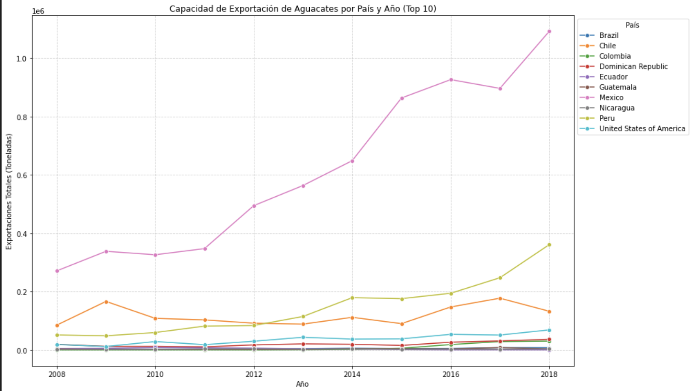

A continuación se realiza el calculo del valor por tonelada (Export Value dividido por Export Quantity).

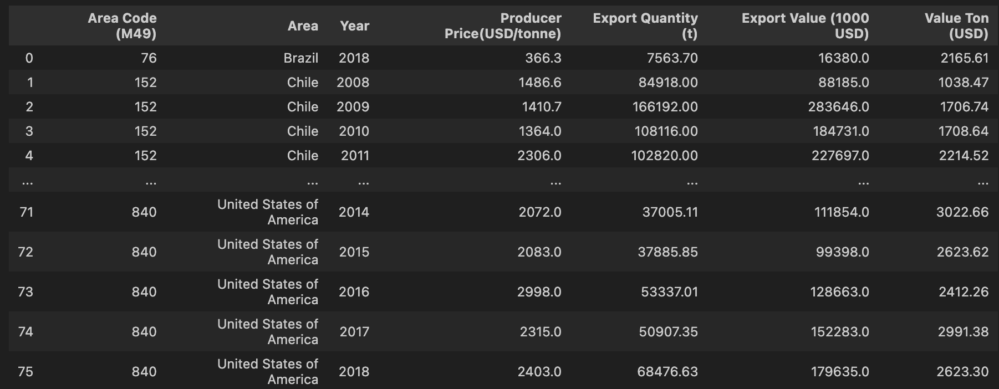
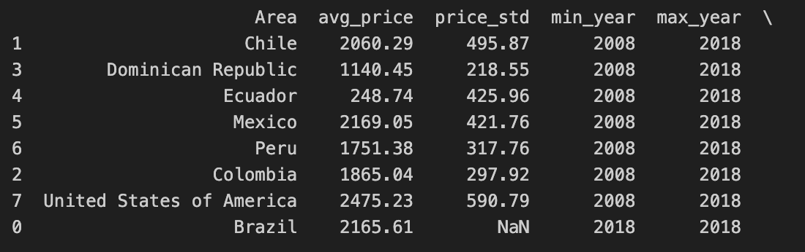

Para el calculo de la proyección de precios futuros para cada país se pudieron implementar varios modelos. En primer lugar la regresión lineal, seguido de regresión polinómica.

#### Represión lineal

Podemos observar el rango de precios obtenido en la regresión lineral con un +-10% para cada uno de los países exportadores, podemos notar un ligero aumento en Chile, Estados Unidos y Ecuador, en cambio en otros retrocede, y en otros se mantiene, como lo son Brasil y República Dominicana, para el caso de Brasil esto se debe a que tiene un histórico más limitado, en el caso de República Dominciana, se caracteriza por mantener buenos precios.

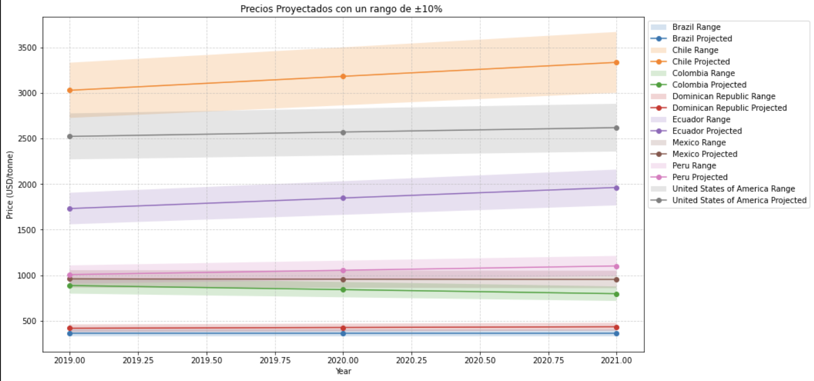

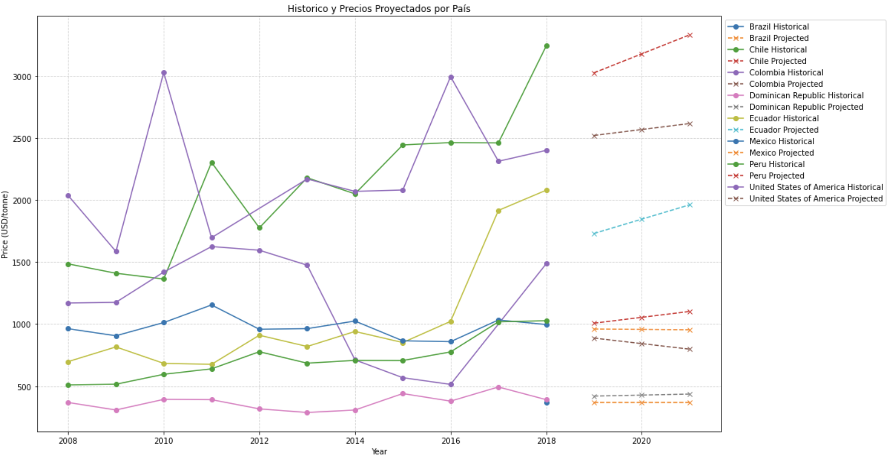

**Tendencias Históricas:**
- La mayoría de los países muestran fluctuaciones en los precios históricos entre 2008 y 2018.
- Colombia y Chile presentan picos y caídas notorias en ciertos años, lo que podría sugerir eventos económicos específicos o variabilidad alta en el mercado.

**Proyecciones:**
- Las proyecciones (líneas punteadas) para todos los países muestran trayectorias lineales debido a la naturaleza de la regresión lineal.
- Para países como Chile y Estados Unidos, la proyección parece seguir la tendencia ascendente de los últimos años históricos, lo cual parece razonable.
- En México y Ecuador, las proyecciones son prácticamente planas, lo que indica poca variabilidad en los datos históricos recientes.

**Sobreajuste o Subajuste:**
- Algunos países con tendencias más complejas (como Colombia) muestran proyecciones lineales que no capturan las fluctuaciones históricas, lo que podría sugerir subajuste.
- Para otros países con datos estables (como Brazil y México), la proyección lineal se ajusta razonablemente bien.
**Anomalías:**

- El caso de Colombia merece atención debido a los picos y caídas bruscas. Aplicar un modelo más complejo, como regresión polinómica o modelos de series temporales, podría capturar mejor la dinámica de estos datos.

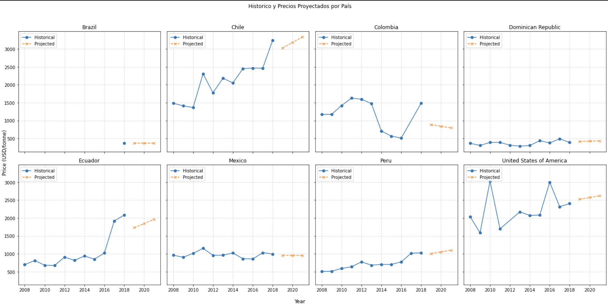

	Area	R2
	Brazil	NaN
	Chile	0.796691
	Colombia	0.112521
	Dominican Republic	0.189719
	Ecuador	0.615056
	Mexico	0.011261
	Peru	0.822800
	United States of America	0.122737

Con el cálculo del error cuadrático medio observamos que el modelo de regresión es adecuado para Chile, Perú y Ecuador en cambio para lugares más fluctuantes como Colombia, Republica Dominicana, México y Estados Unidos se provará un modelo de regresión polinómica de grado dos.

Datos proyectados por país.

	Area	Year	Price(USD/tonne)
	Chile	2019	3029.22
	Chile	2020	3182.57
	Chile	2021	3335.92
	Ecuador	2019	1731.96
	Ecuador	2020	1847.66
	Ecuador	2021	1963.37
	Peru	2019	1007.52
	Peru	2020	1054.91
	Peru	2021	1102.30
	United States of America	2019	2523.43
	United States of America	2020	2571.51
	United States of America	2021	2619.58

#### Regresión Polinómica

Area	Polynomial R2
Colombia	0.115992
Dominican Republic	0.302195
Mexico	0.014406
United States of America	0.123772

Para Colombia, un modelo polinómico de grado 2 mejora considerablemente el ajuste.
México y República Dominicana aún muestran un ajuste limitado. Modelos más complejos, como series temporales o modelos no lineales como Random Forest, podrían ser más efectivos.

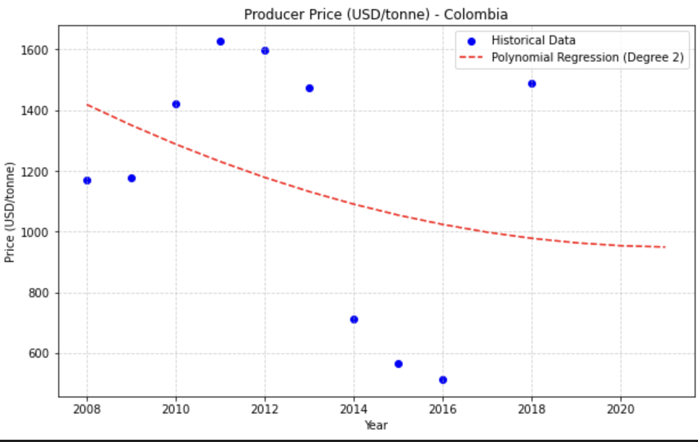

	Year	Projected Price (USD/tonne)	Type
	2019	963.041737	Projected
	2020	953.520684	Projected
	2021	949.318129	Projected

---

## **3. Recomendaciones Estratégicas para la compra óptima de aguacates**

Basado en el anális de los datos hemos identificado dos estrategias recomendadas, una centralizada y otra descentralizada. Ambas estrategias ofrecen ventajas según las prioridades de la cadena hotelera: si se busca estabilidad y precios competitivos, la centralización es clave; si nuestro cliente  prefiere adaptabilidad y mitigación de riesgos o picos por eventos, la descentralización será más efectiva.

A continuación brindamos un breve detalle de ambas recomendaciones:

### Estrategia Centralizada

* Descripción: Comprar a un único proveedor en grandes volúmenes, negociando precios preferenciales y condiciones más favorables. Por ejemplo: México y Estados Unidos.

* Pros: Mejores precios por volumen, relaciones más fuertes con el proveedor, simplificación de la gestión de compras.

* Cons: Riesgo de dependencia de un solo proveedor, vulnerabilidad ante variaciones en la calidad o precios, falta de flexibilidad.

### Estrategia Descentralizada

* Descripción: Diversificar las compras entre varios proveedores, ajustando la selección según eventos, temporada o fluctuaciones de precios. Proponemos Perú, República Dominicana y Chile

* Pros: Mayor flexibilidad y adaptabilidad a cambios de mercado, acceso a una variedad de productos y calidades, menor riesgo de interrupciones en el suministro.

* Cons: Mayor complejidad en la gestión, posible incremento de costos logísticos y administrativos, dificultades para negociar precios competitivos.

### Otras consideraciones
1. **Fecha de Vencimiento:** Considerar el estado de madurez del aguacate al momento de la compra para reducir pérdidas/merma por vencimiento. Recomendable, según tiempo logísticos entre 5 y 15 días previo al consumo.
2. **Sostenibilidad y Marketing:** Promocionar la inclusión de aguacates como parte de un menú saludable y eco-friendly para mejorar la percepción de marca.
3. **Ajuste Estacional:** Diseñar estrategias de compra estacional para minimizar el impacto de la volatilidad en precios.

---

## **Acerca del Proyecto**
Este proyecto fue desarrollado como parte de un trabajo práctico del programa Data Science de la UOC. Nuestro enfoque combina análisis de datos avanzados de fuentes internas/exógenas con una narrativa estratégica para apoyar la toma de decisiones de la cadena hotelera, con dos recomendaciones finales.
