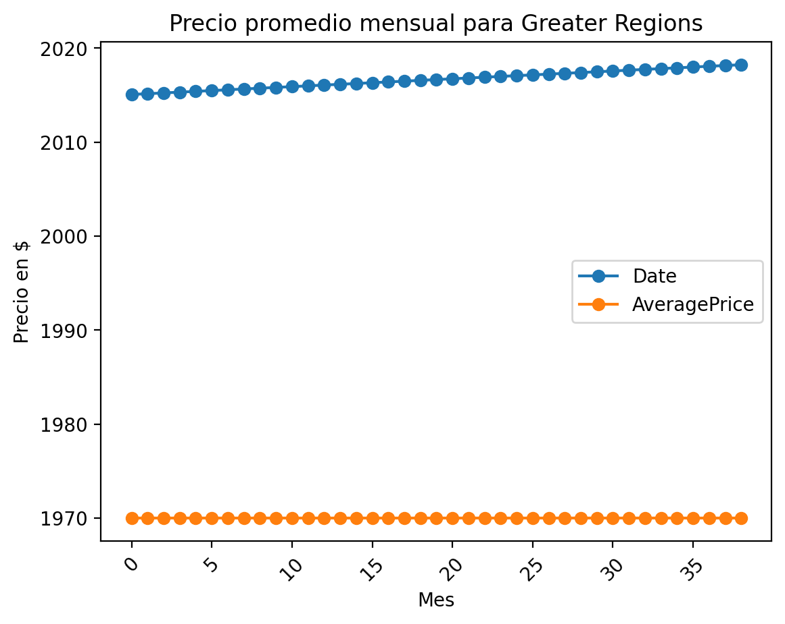
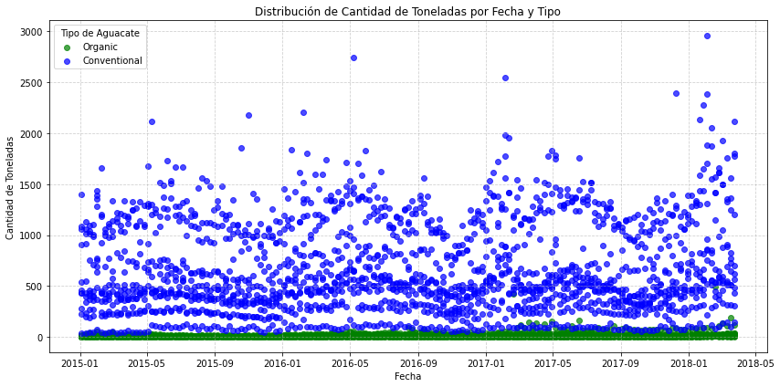
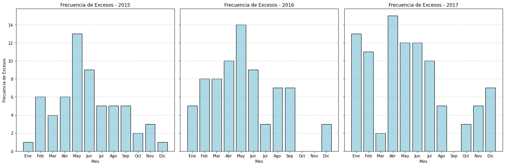

# **Estudio de Mercado y Análisis de Aguacates para Cadena Hotelera**

Nombre del proyecto
# **"AvoEconomics: The Business of Green Gold"**
Cómo el aguacate transforma estrategias en los hoteles de lujo de la cadena Hilton.

## **Equipo de Proyecto**

* Julieth Vasco Bueno
* Gustavo Chavez

## **Planificación**

En nuestro proyecto, adoptamos una metodología ágil para planificar y gestionar tareas, utilizando GitHub como nuestra principal herramienta de colaboración. 
Esta metodología nos permitió dividir el trabajo en pequeñas entregas incrementales, priorizando y ordenando la colaboración interna.  
En GitHub, implementamos un tablero Kanban, estructurando el flujo de trabajo en columnas como "Por hacer", "En progreso" y "Completado". 

Cada tarea fue registrada como un *issue*, con descripciones claras, asignaciones responsables y etiquetas que facilitaron la organización y priorización. 
Los *milestones* nos ayudaron a definir metas clave y seguir nuestro progreso en tiempo real.  

Esta estrategia no solo aumentó la transparencia del equipo, sino que también fomentó una comunicación más fluida y una toma de decisiones más ágil. 

---

## **1. Diagnóstico Actual: Explorando Oportunidades en el Mercado de Aguacates**

Nuestro cliente, la cadena hotelera Hilton (a partir de ahora "Cliente"), esta enfocada en mantener una experiencia premium, con una oferta gastronómica optimizada. 

""

Con huéspedes que en los últimos años han demostrado un creciente interés en alimentos saludables y sostenibles, el equipo de Planificación Estratégica del Cliente ha identificado una oportunidad para optimizar los costos y desperdicios de sus menús diseñados para atraer a un mercado de turistas estadounidenses y mexicanos, conocidos por su afinidad cultural con el aguacate focalizandose en dos zonas estratégicas:

1. Zona sur de EEUU: desde California hasta Florida, donde reside la mayoría de mexicanos debido a la cerca con su país de origen.
2. New York: por tener un público exigente y de alto poder adquisitivo.

Por lo tanto, los 12 hoteles alcanzados para este estudio son:

Por lo tanto, las zonas geográficas alcanzadas en esta iniciativa son:

### Premisas Iniciales
- **Situación actual:** La cadena hotelera no tiene una buena gestión de compras, ni un enfoque claro en alimentos saludables ni en personalización cultural en sus menús premium.  

- **Problemáticas:**  
  1. Fluctuación de precios de aguacates en mercados clave.  
  2. Falta de claridad sobre la potencial demanda de aguacates en cada hotel.  
  3. Alta tasa de desperdicios de aguacates.

- **Mercado objetivo:** Turistas de EEUU y México, y visitantes internacionales que demandan opciones frescas y saludables.  

- **Competencia:** Resorts líderes que incluyen guacamole gourmet, tostadas de aguacate y opciones con aguacate en sus menús. 

### Informe As-Is
Actualmente, el menú de nuestro cliente carece de opciones diferenciadas, lo que podría representar una pérdida de mercado en comparación con hoteles de la misma categoría. Además, no se han evaluado los precios y calidad del aguacate de regiones clave como México, Perú o la misma California para garantizar rentabilidad y la sostenibilidad de la oferta en el tiempo. Tampoco se planifica y negocio la compra de aguacates de forma adecuada. 

Debido a la amplia opciones de mejoras y oportunidades, para esta primera fase se acuerda con el Cliente focalizarnos en responder dos preguntas claves de negocio:

  **Eficiencia en la cadena de suministro y abastecimiento** 
  
  Pregunta clave: ¿Estamos comprando los aguacates de proveedores que equilibran precio, calidad y confiabilidad, minimizando el tiempo de transporte y maximizando la frescura?
  
  Por qué es importante: Los aguacates tienen una vida útil limitada. Trabajar con proveedores cercanos o con procesos logísticos ágiles asegura que lleguen frescos y se reduzca el desperdicio.
  

  **Monitoreo del desperdicio**

  Pregunta clave: ¿Qué porcentaje de los aguacates comprados termina en desperdicio, y qué procesos estamos implementando para reducirlo?
  
  Por qué es importante: El desperdicio no solo afecta la rentabilidad, sino que también contradice objetivos sostenibles. Evaluar puntos críticos (preparación, almacenamiento o sobrantes en platos) es clave para minimizar pérdidas.

---

## **2. Transformando Datos en Oportunidades: Análisis de los Datos**

Para abordar estos desafíos, hemos realizado un análisis exhaustivo basado en datos relevantes sobre precios y calidad del aguacate. Para ellos hemos incorporado variables internas y exógenas. A continuación detallamos las fuentes de datos utilizadas:

### Fuentes Internas:
- **Consumo gastronómico de la cadena hotelera:** (consumoshistoricos.csv): Contiene ...<COMPLETAR> 

- **Avocado:** (avocado.csv): Contiene los datos venta de aguacate que nuestro cliente ha comprado de una consultora para analizar internamente. Este acrchivo contiene los campos: Date,AveragePrice,Total Volume,4046,4225,4770,Total Bags,Small Bags,Large Bags,XLarge Bags,type,year,region 

- **Campo derivado**: Para poder estimar la cantidad de aguacate convencionales y orgánicos contenidos en una tonelada y estimar el precio de la tonelada, hemos creado/agregado nuevos campos derivados. Para estimar los pesos promedios de cada aguacate según su tipo nos hemos basado en la siguiente tabla de estandarización:

Por lo tanto, determinamos los siguientes pesos promedio según el tipo de aguacate: **convencional 250gr** y **orgánico 300gr**. 

### Fuentes Exógenas:
- **Organización de las Naciones Unidas para la Alimentación y la Agricultura:** (FAOSTAT_Crops and livestock products.csv) Datos históricos y en tiempo real de mercados clave (México, Perú, California).  
- **Organización de las Naciones Unidas para la Alimentación y la Agricultura:** (FAOSTAT_data_avocado_Producer_Prices.csv) Datos de búsqueda y tendencias de redes sociales, como Instagram y Google Trends.  

- **Estadísticas de Turismo:** Afiliación cultural y preferencias alimentarias de turistas mexicanos en los destinos clave.

### Metodología
1. **Variables Exógenas:** No fue necesario hacer scraping debido a que pudimos obtener acceso a datos oficiales del mercado de aguacates. 
2. **Análisis Exploratorio:** Visualización de fluctuaciones de precios según región, temporada y otras variables que mostraremos a continuación.  
3. **Análisis de Cohortes:** Análsis de la estacionalidad, desperdicios y eventos.
4. **Modelo de Clasificación:** Utilizamos este modelo para el análisis de proveedores top 10.
5. **Modelos Predictivos:** Forecasting para determinar los precios en las próximas temporadas.

### Análisis

1. **Variables Exógenas:** No fue necesario realizar scraping debido a que pudimos obtener acceso a datos oficiales del mercado de aguacates descargando un archivo csv.

   
   
   
- **Hallazgo:** Los datos recibidos son heterogéneos, exceden el alcance de nuestro foco actual por lo que debemos preparar y ordenar el set de datos adecuadamente, redefiniendo por ejemplos las 5  regiones a analizar: New york, Louisiana, Texas, Florida, California. Lo mismo aplicado a los datos exógenos recolectados. Esto aplica tanto a las variables exógenas visualizadas aquí, como a los datos internos de histórico de compras.

2. **Análisis Exploratorio:** Visualización de fluctuaciones de precios según región, temporada y otras variables que mostraremos a continuación.  

- **Hallazgo:** Luego de proyectar la proporción de aguacates convencionales y orgánicos, y estimar su peso, calculamos también el peso en toneladas y precio, procedemos al análisis de series de tiempo para determinar el comportamiento por mes y región.
Se puede observar que anualmente se repite una bajada en el AveragePrice en el mes de Febrero así como un pico de subida en los meses de Octubre y Noviembre.
Esto podría deberser a que en septiembre inicia el fin de la temporada de cosecha del aguacate, y por eso tenemos un costo más alto en Octubre y Noviembre, si le sumamos también que en Noviembre hay el día de Acción de Gracias donde es muy común el uso del aguacate para hacer Guacamole en USA.

3. **Análisis de Cohortes:** Análsis de la estacionalidad, desperdicios y eventos.

- **Hallazgo:**

   
4. **Modelo de Clasificación:** Utilizamos este modelo para el análisis de proveedores top 10.

<IMAGE>

- **Hallazgo:**

5. **Modelos Predictivos:** Forecasting para determinar los precios en las próximas temporadas.
<IMAGE>
- **Hallazgo:**

---

## **3. Recomendaciones Estratégicas para la compra óptima de aguacates**

Basado en el anális de los datos hemos identificado dos estrategias recomendadas, una centralizada y otra descentralizada. Ambas estrategias ofrecen ventajas según las prioridades de la cadena hotelera: si se busca estabilidad y precios competitivos, la centralización es clave; si nuestro cliente  prefiere adaptabilidad y mitigación de riesgos o picos por eventos, la descentralización será más efectiva.

A continuación brindamos un breve detalle de ambas recomendaciones:

### Estrategia Centralizada

* Descripción: Comprar a un único proveedor en grandes volúmenes, negociando precios preferenciales y condiciones más favorables. Por ejemplo: 

* Pros: Mejores precios por volumen, relaciones más fuertes con el proveedor, simplificación de la gestión de compras.

* Cons: Riesgo de dependencia de un solo proveedor, vulnerabilidad ante variaciones en la calidad o precios, falta de flexibilidad.

### Estrategia Descentralizada

* Descripción: Diversificar las compras entre varios proveedores, ajustando la selección según eventos, temporada o fluctuaciones de precios.

* Pros: Mayor flexibilidad y adaptabilidad a cambios de mercado, acceso a una variedad de productos y calidades, menor riesgo de interrupciones en el suministro.

* Cons: Mayor complejidad en la gestión, posible incremento de costos logísticos y administrativos, dificultades para negociar precios competitivos.

### Otras consideraciones
1. **Fecha de Vencimiento:** Considerar el estado de madurez del aguacate al momento de la compra para reducir pérdidas/merma por vencimiento. Recomendable, según tiempo logísticos entre 5 y 15 días previo al consumo.  
2. **Sostenibilidad y Marketing:** Promocionar la inclusión de aguacates como parte de un menú saludable y eco-friendly para mejorar la percepción de marca.  
3. **Ajuste Estacional:** Diseñar estrategias de compra estacional para minimizar el impacto de la volatilidad en precios.  

### Propuesta de Acción
- Incluir platos como tostadas gourmet, guacamole en piedra y smoothies con aguacate.  
- Negociar contratos estacionales con productores mexicanos para asegurar la mejor calidad a precios competitivos.  
- Realizar campañas dirigidas en redes sociales para atraer al mercado objetivo.

---

## **Cómo Usar Este Repositorio**
1. **Carpeta `/data`:** Contiene los datasets utilizados, incluyendo precios de compra históricos y datos exógenos.  
2. **Carpeta `/images`:** Contiene todas las imágenes utilizadas en este Readme.  
3. **Carpeta `/utils`:** Contiene funciones utilizadas para ordenar y redefinir las regiones foco.  

---

## **Acerca del Proyecto**
Este proyecto fue desarrollado como parte de un trabajo práctico del programa Data Science de la UOC. Nuestro enfoque combina análisis de datos avanzados de fuentes internas/exógenas con una narrativa estratégica para apoyar la toma de decisiones de la cadena hotelera, con dos recomendaciones finales.
